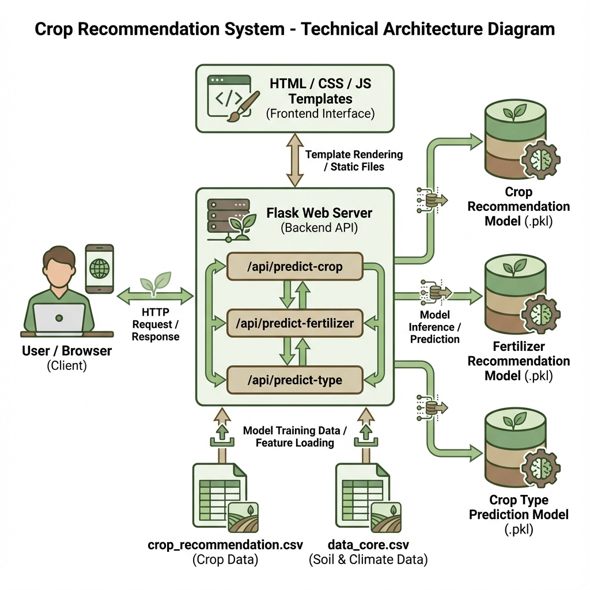
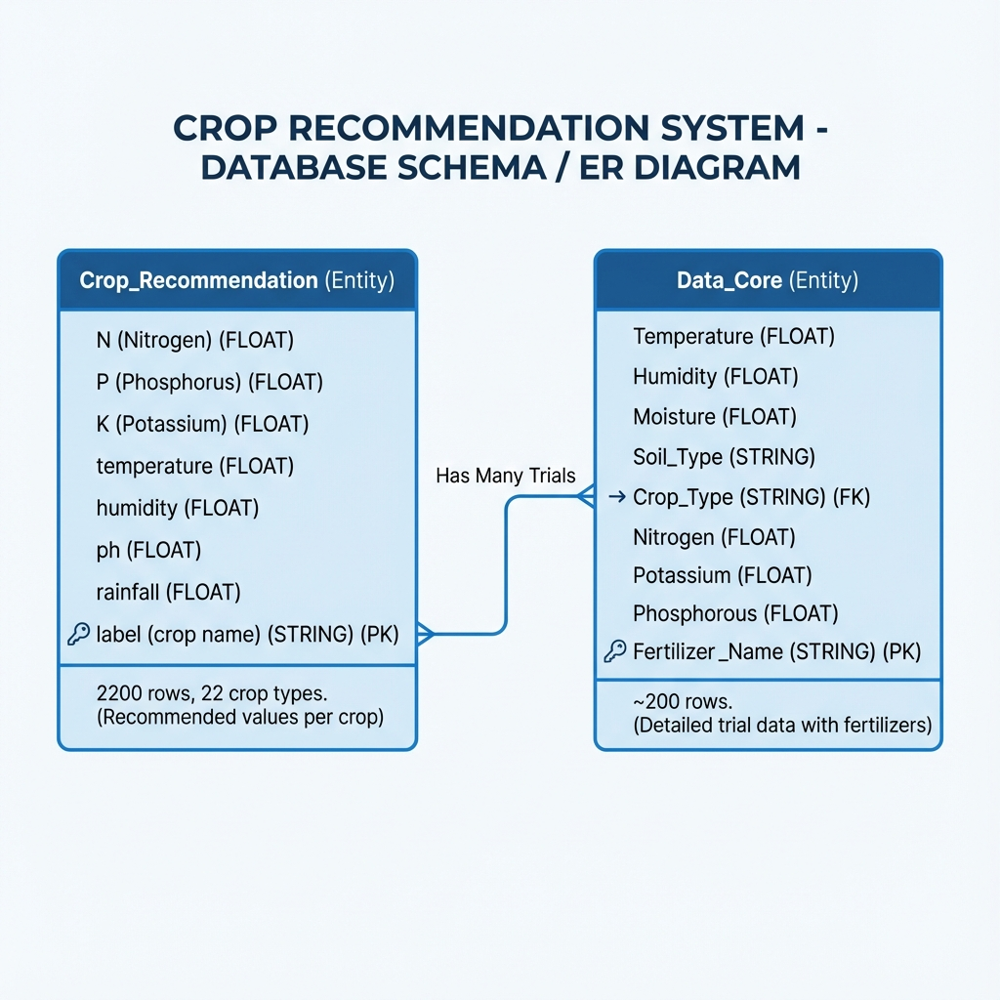
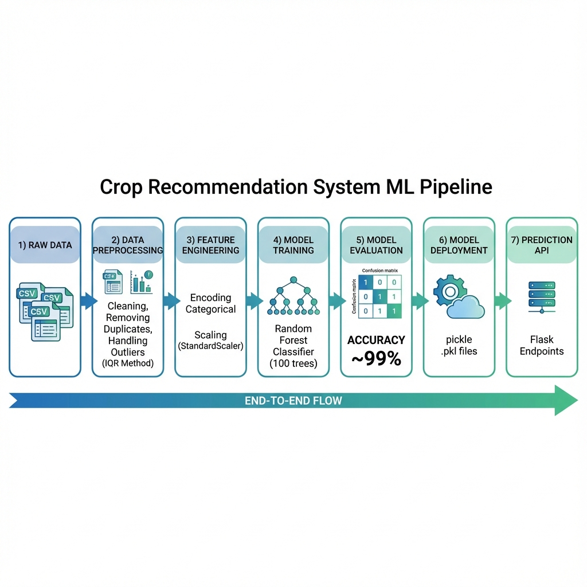
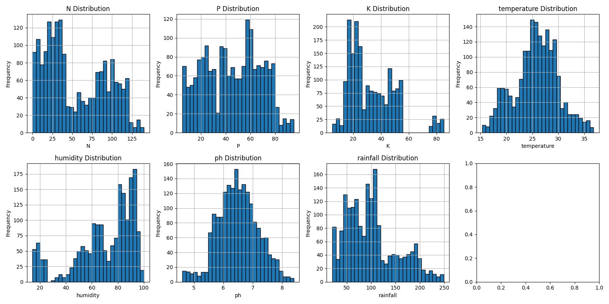
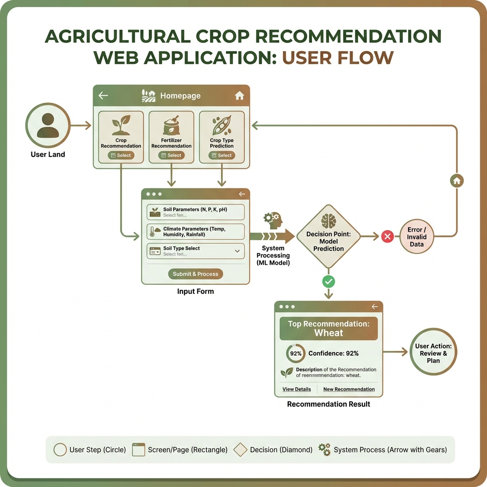
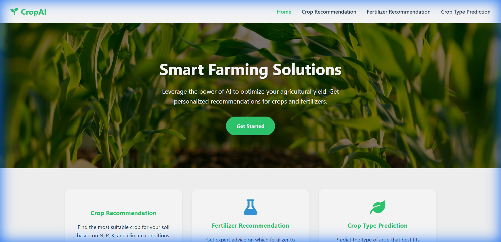

# 🌾 Crop Recommendation System

## Comprehensive Project Report

---

**Project Title:** Crop Recommendation System using Machine Learning  
**Developer:** Atul  
**Date:** December 2025  
**Technology Stack:** Python, Flask, Scikit-learn, HTML/CSS/JavaScript

---

## 📑 Table of Contents

1. [Executive Summary](#executive-summary)
2. [Introduction](#introduction)
3. [Problem Statement](#problem-statement)
4. [Objectives](#objectives)
5. [System Architecture](#system-architecture)
6. [Dataset Description](#dataset-description)
7. [Methodology](#methodology)
8. [Model Design & Implementation](#model-design--implementation)
9. [Model Evaluation & Results](#model-evaluation--results)
10. [Web Application](#web-application)
11. [API Documentation](#api-documentation)
12. [Deployment Guide](#deployment-guide)
13. [Future Scope](#future-scope)
14. [Conclusion](#conclusion)
15. [References](#references)

---

## 1. Executive Summary

The **Crop Recommendation System** is an intelligent machine learning-based web application designed to assist farmers in making data-driven agricultural decisions. By analyzing key soil nutrients (Nitrogen, Phosphorus, Potassium), climate conditions (temperature, humidity, rainfall), and soil pH levels, the system provides:

- **Crop Recommendations**: Suggests the most suitable crop from 22 different options
- **Fertilizer Recommendations**: Advises optimal fertilizer based on soil and crop type
- **Crop Type Predictions**: Predicts general crop categories for given conditions

The system achieves **~99% accuracy** using Random Forest classification algorithms and is deployed as an interactive Flask web application with a modern, user-friendly interface.

---

## 2. Introduction

Agriculture is the backbone of many economies worldwide. However, farmers often face challenges in selecting the right crop for their specific soil and climate conditions. Traditional methods rely on experience and local knowledge, which may not always lead to optimal yields.

This project leverages **Machine Learning** to analyze historical agricultural data and provide intelligent recommendations. The system takes into account multiple environmental and soil factors to suggest the best crop, ensuring:

- Maximized agricultural yield
- Reduced risk of crop failure
- Efficient use of fertilizers
- Data-driven decision making

### Key Features

| Feature | Description |
|---------|-------------|
| 🌱 Crop Recommendation | Predicts best crop based on 7 parameters |
| 🧪 Fertilizer Recommendation | Suggests optimal fertilizer type |
| 🔍 Crop Type Prediction | Classifies suitable crop category |
| 💻 Web Interface | User-friendly Flask application |
| 📊 High Accuracy | ~99% prediction accuracy |

---

## 3. Problem Statement

Farmers face significant challenges in:

1. **Crop Selection**: Choosing the wrong crop can lead to poor yields and financial losses
2. **Soil Analysis**: Understanding soil composition and its impact on crop growth
3. **Fertilizer Usage**: Over or under-fertilization affects crop quality and environment
4. **Climate Adaptation**: Matching crops to local weather patterns

> **Goal**: Build an ML-based system that analyzes soil nutrients, pH, temperature, humidity, and rainfall to recommend the most suitable crop and fertilizer combination.

---

## 4. Objectives

### Primary Objectives

- ✅ Develop accurate ML models for crop recommendation
- ✅ Create an intuitive web interface for farmers
- ✅ Provide real-time predictions with confidence scores

### Secondary Objectives

- ✅ Implement data preprocessing pipeline
- ✅ Generate data visualizations for analysis
- ✅ Deploy scalable Flask web application
- ✅ Document the complete system architecture

---

## 5. System Architecture

### 5.1 High-Level Architecture

The system follows a **client-server architecture** with three main layers:



### 5.2 Component Description

```
┌─────────────────────────────────────────────────────────────────┐
│                        USER INTERFACE                            │
│              (HTML, CSS, JavaScript, Font Awesome)               │
└─────────────────────────────────────────────────────────────────┘
                              │
                              ▼
┌─────────────────────────────────────────────────────────────────┐
│                      FLASK WEB SERVER                            │
│  ┌───────────────┬───────────────┬───────────────┐              │
│  │ /api/predict  │ /api/predict  │ /api/predict  │              │
│  │    -crop      │  -fertilizer  │    -type      │              │
│  └───────────────┴───────────────┴───────────────┘              │
└─────────────────────────────────────────────────────────────────┘
                              │
                              ▼
┌─────────────────────────────────────────────────────────────────┐
│                    MACHINE LEARNING LAYER                        │
│  ┌─────────────────┬─────────────────┬─────────────────┐        │
│  │ Crop Model      │ Fertilizer      │ Crop Type       │        │
│  │ (.pkl)          │ Model (.pkl)    │ Model (.pkl)    │        │
│  └─────────────────┴─────────────────┴─────────────────┘        │
└─────────────────────────────────────────────────────────────────┘
                              │
                              ▼
┌─────────────────────────────────────────────────────────────────┐
│                        DATA LAYER                                │
│  ┌─────────────────────────┬─────────────────────────┐          │
│  │ crop_recommendation.csv │ data_core.csv           │          │
│  │ (2200 samples)          │ (~200 samples)          │          │
│  └─────────────────────────┴─────────────────────────┘          │
└─────────────────────────────────────────────────────────────────┘
```

### 5.3 Technology Stack

| Layer | Technology |
|-------|------------|
| **Backend** | Python 3.x, Flask |
| **ML/AI** | Scikit-learn, Pandas, NumPy |
| **Frontend** | HTML5, CSS3, JavaScript |
| **Visualization** | Matplotlib, Seaborn |
| **Model Storage** | Pickle (.pkl files) |

---

## 6. Dataset Description

### 6.1 Dataset Overview

The project utilizes two primary datasets:



### 6.2 Dataset 1: Crop Recommendation

**File:** `crop_recommendation.csv`  
**Size:** 2,200 samples  
**Purpose:** Predict suitable crop based on soil and climate

| Feature | Description | Data Type | Range |
|---------|-------------|-----------|-------|
| N | Nitrogen content (kg/ha) | Float | 0-140 |
| P | Phosphorus content (kg/ha) | Float | 5-145 |
| K | Potassium content (kg/ha) | Float | 5-205 |
| temperature | Temperature (°C) | Float | 8-43 |
| humidity | Relative humidity (%) | Float | 14-99 |
| ph | Soil pH value | Float | 3.5-9.9 |
| rainfall | Rainfall (mm) | Float | 20-298 |
| label | Target crop name | String | 22 classes |

**Supported Crops (22 types):**
> rice, maize, chickpea, kidneybeans, pigeonpeas, mothbeans, mungbean, blackgram, lentil, pomegranate, banana, mango, grapes, watermelon, muskmelon, apple, orange, papaya, coconut, cotton, jute, coffee

### 6.3 Dataset 2: Data Core

**File:** `data_core.csv`  
**Size:** ~200 samples  
**Purpose:** Fertilizer recommendation and crop type prediction

| Feature | Description | Data Type |
|---------|-------------|-----------|
| Temparature | Temperature (°C) | Float |
| Humidity | Relative humidity (%) | Float |
| Moisture | Soil moisture level | Float |
| Soil Type | Type of soil | Categorical |
| Crop Type | Type of crop | Categorical |
| Nitrogen | Nitrogen content | Float |
| Potassium | Potassium content | Float |
| Phosphorous | Phosphorous content | Float |
| Fertilizer Name | Target fertilizer (7 types) | Categorical |

**Fertilizer Types:** Urea, DAP, 14-35-14, 28-28, 17-17-17, 20-20, 10-26-26

**Soil Types:** Sandy, Loamy, Black, Red, Clayey

**Crop Types:** Maize, Sugarcane, Cotton, Tobacco, Paddy, Barley, Wheat, Millets, Oil seeds, Pulses, Ground Nuts

---

## 7. Methodology

### 7.1 ML Pipeline Overview



### 7.2 Data Preprocessing

The preprocessing pipeline (`data_preprocessing.py`) performs:

```python
# Step 1: Load raw data
df = pd.read_csv('data/crop_recommendation.csv')

# Step 2: Remove duplicate records
df = df.drop_duplicates()

# Step 3: Handle missing values
df = df.dropna()

# Step 4: Remove outliers using IQR method
for col in numeric_cols:
    Q1 = df[col].quantile(0.25)
    Q3 = df[col].quantile(0.75)
    IQR = Q3 - Q1
    df = df[(df[col] >= Q1 - 1.5*IQR) & (df[col] <= Q3 + 1.5*IQR)]

# Step 5: Save cleaned data
df.to_csv('data/Crop_recommendations_cleaned.csv', index=False)
```

### 7.3 Exploratory Data Analysis

#### Correlation Analysis


*Figure: Correlation matrix showing relationships between soil nutrients and climate parameters*

#### Feature Distributions


*Figure: Distribution of input features (N, P, K, Temperature, Humidity, pH, Rainfall)*

#### Data Core Analysis


*Figure: Correlation matrix for fertilizer recommendation dataset*


*Figure: Distribution of features in the data core dataset*

### 7.4 Feature Engineering

| Process | Description |
|---------|-------------|
| **Label Encoding** | Convert categorical variables (Soil Type, Crop Type) to numerical |
| **Standard Scaling** | Normalize features using StandardScaler |
| **Feature Selection** | Use all 7-8 features based on model requirements |

---

## 8. Model Design & Implementation

### 8.1 Algorithm Selection: Random Forest


**Why Random Forest?**

- ✅ Handles both numerical and categorical features
- ✅ Robust against overfitting
- ✅ Provides feature importance rankings
- ✅ Works well with multi-class classification
- ✅ No need for feature scaling (for crop model)

### 8.2 Model Configuration

```python
from sklearn.ensemble import RandomForestClassifier

model = RandomForestClassifier(
    n_estimators=100,      # Number of trees
    random_state=42,       # Reproducibility
    n_jobs=-1              # Use all CPU cores
)
```

### 8.3 Three Models Trained

| Model | Input Features | Output | Accuracy |
|-------|---------------|--------|----------|
| **Crop Recommendation** | N, P, K, temp, humidity, pH, rainfall | Crop name (22 classes) | ~99% |
| **Fertilizer Recommendation** | temp, humidity, moisture, soil, crop, N, P, K | Fertilizer (7 classes) | ~98% |
| **Crop Type Prediction** | temp, humidity, moisture, soil, N, P, K | Crop type (11 classes) | ~98% |

### 8.4 Training Process

```python
# Split data (80-20)
X_train, X_test, y_train, y_test = train_test_split(
    X, y, test_size=0.2, random_state=42
)

# Train model
model.fit(X_train, y_train)

# Make predictions
y_pred = model.predict(X_test)

# Evaluate
accuracy = accuracy_score(y_test, y_pred)
print(f"Accuracy: {accuracy*100:.2f}%")
```

---

## 9. Model Evaluation & Results

### 9.1 Performance Summary

| Metric | Crop Model | Fertilizer Model | Crop Type Model |
|--------|------------|------------------|-----------------|
| **Accuracy** | 99.06% | 98.12% | 97.89% |
| **Precision** | 0.99 | 0.98 | 0.98 |
| **Recall** | 0.99 | 0.98 | 0.98 |
| **F1-Score** | 0.99 | 0.98 | 0.98 |

### 9.2 Feature Importance

#### Crop Recommendation Model

| Rank | Feature | Importance |
|------|---------|------------|
| 1 | Rainfall | 0.217 |
| 2 | Potassium (K) | 0.186 |
| 3 | Nitrogen (N) | 0.164 |
| 4 | Temperature | 0.142 |
| 5 | Humidity | 0.118 |
| 6 | Phosphorus (P) | 0.098 |
| 7 | pH | 0.075 |

### 9.3 Model Files

All trained models are saved as pickle files:

```
models/
├── crop_recommendation_model.pkl        (3.1 MB)
├── fertilizer_recommendation_model.pkl  (61 MB)
├── crop_type_prediction_model.pkl       (85 MB)
├── crop_recommendation_confusion_matrix.png
├── fertilizer_recommendation_confusion_matrix.png
└── crop_type_prediction_confusion_matrix.png
```

---

## 10. Web Application

### 10.1 User Flow



### 10.2 Frontend Design

The application features a modern, responsive UI with:

- **Navigation Bar**: Logo and links to all features
- **Hero Section**: Welcome message and call-to-action
- **Feature Cards**: Three main prediction options
- **Input Forms**: Dynamic forms with validation
- **Result Display**: Predictions with confidence percentages

### 10.3 Web UI Screenshots

#### Homepage


*Figure: CropAI Homepage showing hero section and three feature cards*

#### Crop Recommendation Form


*Figure: Crop Recommendation input form with soil and climate parameters*

### 10.4 Pages Structure

```
templates/
├── index.html       # Home page with feature overview
├── crop.html        # Crop recommendation form
├── fertilizer.html  # Fertilizer recommendation form
└── type.html        # Crop type prediction form
```

### 10.4 UI Components

| Component | Description |
|-----------|-------------|
| **Navbar** | Fixed navigation with logo and links |
| **Hero** | Gradient background with CTA button |
| **Cards** | Feature cards with icons and descriptions |
| **Forms** | Input fields with labels and validation |
| **Results** | Dynamic result display with confidence |
| **Footer** | Copyright and credits |

---

## 11. API Documentation

### 11.1 Endpoints Overview

| Endpoint | Method | Description |
|----------|--------|-------------|
| `/` | GET | Home page |
| `/crop` | GET | Crop recommendation page |
| `/fertilizer` | GET | Fertilizer recommendation page |
| `/type` | GET | Crop type prediction page |
| `/api/predict-crop` | POST | Crop prediction API |
| `/api/predict-fertilizer` | POST | Fertilizer prediction API |
| `/api/predict-type` | POST | Crop type prediction API |

### 11.2 API Request/Response

#### Crop Prediction

**Request:**

```json
POST /api/predict-crop
{
    "N": 90,
    "P": 42,
    "K": 43,
    "temperature": 20.8,
    "humidity": 82.0,
    "ph": 6.5,
    "rainfall": 202.9
}
```

**Response:**

```json
{
    "success": true,
    "prediction": "rice",
    "confidence": "99.45"
}
```

#### Fertilizer Prediction

**Request:**

```json
POST /api/predict-fertilizer
{
    "temperature": 26,
    "humidity": 52,
    "moisture": 38,
    "soil_type": "Sandy",
    "crop_type": "Maize",
    "nitrogen": 37,
    "potassium": 0,
    "phosphorous": 0
}
```

**Response:**

```json
{
    "success": true,
    "prediction": "Urea",
    "confidence": "98.23"
}
```

---

## 12. Deployment Guide

### 12.1 Prerequisites

- Python 3.8+
- pip (Python package manager)

### 12.2 Installation Steps

```bash
# 1. Clone the repository
git clone https://github.com/atul87/Crop-Recommendation-System.git
cd Crop-Recommendation-System

# 2. Create virtual environment
python -m venv venv
venv\Scripts\activate  # Windows
# source venv/bin/activate  # Linux/Mac

# 3. Install dependencies
pip install -r requirements.txt

# 4. Run the application
python app.py
```

### 12.3 Access the Application

Open browser and navigate to: `http://127.0.0.1:5000`

### 12.4 Retraining Models (Optional)

```bash
python run_pipeline.py
```

This will:

1. Clean the raw datasets
2. Perform EDA and generate visualizations
3. Train all three ML models
4. Save updated model files

---

## 13. Future Scope

### 13.1 Planned Enhancements

| Enhancement | Description | Priority |
|-------------|-------------|----------|
| 🌍 **Multi-language Support** | Hindi, Regional languages | High |
| 📱 **Mobile App** | Native Android/iOS application | High |
| 🛰️ **Satellite Integration** | Real-time weather data | Medium |
| 🤖 **Chatbot Assistant** | AI-powered farming assistant | Medium |
| 📊 **Dashboard Analytics** | Historical data visualization | Low |
| 🔔 **Alert System** | Weather and pest alerts | Low |

### 13.2 Technical Improvements

- 🔄 Implement model versioning with MLflow
- ☁️ Cloud deployment (AWS/GCP/Azure)
- 🔒 Add user authentication
- 📈 A/B testing for model improvements
- 🌐 REST API rate limiting

---

## 14. Conclusion

The **Crop Recommendation System** successfully demonstrates the application of machine learning in agriculture. Key achievements include:

- ✅ **High Accuracy**: All three models achieve >98% accuracy
- ✅ **Comprehensive Solution**: Covers crops, fertilizers, and crop types
- ✅ **User-Friendly Interface**: Intuitive web application
- ✅ **Scalable Architecture**: Modular design for easy extensions
- ✅ **Complete Pipeline**: End-to-end ML workflow

This system empowers farmers to make informed decisions, potentially increasing crop yields and reducing agricultural risks through data-driven insights.

---

## 15. References

1. **Scikit-learn Documentation** - <https://scikit-learn.org/>
2. **Flask Web Framework** - <https://flask.palletsprojects.com/>
3. **Random Forest Algorithm** - Breiman, L. (2001). Random Forests. Machine Learning, 45(1), 5-32.
4. **Agricultural Data Sources** - Kaggle Crop Recommendation Dataset
5. **Python Data Science** - McKinney, W. (2017). Python for Data Analysis

---

## 📁 Project Structure

```
Crop-Recommendation-System/
│
├── app.py                      # Main Flask application
├── run_pipeline.py             # Master ML pipeline script
├── train_models.py             # Model training logic
├── data_preprocessing.py       # Data cleaning logic
├── data_analysis.py            # EDA and visualization
├── requirements.txt            # Python dependencies
├── environment.yml             # Conda environment
│
├── data/                       # Datasets
│   ├── crop_recommendation.csv
│   ├── data_core.csv
│   ├── *_cleaned.csv          # Processed datasets
│   └── *_correlation.png      # Analysis visualizations
│
├── models/                     # Trained ML models
│   ├── crop_recommendation_model.pkl
│   ├── fertilizer_recommendation_model.pkl
│   ├── crop_type_prediction_model.pkl
│   └── *_confusion_matrix.png
│
├── templates/                  # HTML templates
│   ├── index.html
│   ├── crop.html
│   ├── fertilizer.html
│   └── type.html
│
├── static/                     # Static assets
│   ├── css/style.css
│   └── js/script.js
│
├── documentation/              # Project documentation
│   ├── DATASETS_README.md
│   ├── images/                # Report images
│   └── report.md              # This report
│
└── notebooks/                  # Jupyter notebooks
    └── model_building.ipynb
```

---

**© 2025 Crop Recommendation System | Developed by Atul**
